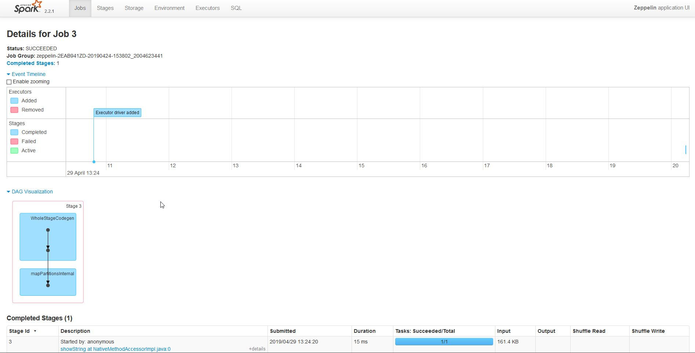

<table>
<tr>
<td style="width: 50%">
<h2>Управление облаком через Terraform</h2>

</td>
</tr>
<td style="width: 50%">
<h2>Управление облаком через Terraform</h2>

</td>
</table>

<table>
<tr>
<td style="width: 50%">
<h2>Управление облаком через Terraform</h2>

</td>
</tr>
<td style="width: 50%">
<h2>Управление облаком через Terraform</h2>

</td>
</table>

#################################################################################################

## Управление облаком через Terraform
* [Управление облаком через Terraform](terraform/)

### yandex_kubernetes_cluster  
https://www.terraform.io/docs/providers/yandex/d/datasource_kubernetes_cluster.html  

### yandex_kubernetes_node_group  
https://www.terraform.io/docs/providers/yandex/d/datasource_kubernetes_node_group.html  
### yandex_kubernetes_cluster  
https://www.terraform.io/docs/providers/yandex/r/kubernetes_cluster.html  

### yandex_kubernetes_node_group  
https://www.terraform.io/docs/providers/yandex/r/kubernetes_node_group.html  

#################################################################################################

## Задания по работе с СУБД
* [Работа с управляемым PostgreSQL](postgresql/)
* [Работа с управляемым Clickhouse](clickhouse/)
* [Работа с YDB](ydb/)
## Задания по работе с инфраструктурой и сетью
* [Работа с виртуальными машинами](compute-instances/)
* [Работа с группами виртуальных машин ( Instance Groups )](instance-groups/)
* [Работа с KMS](kms/)
* [Сетевые Сервисы Яндекс.Облака (VPC, Load Balancer и Anti-DDoS) ](vpc/)
* [Работа с Managed Service for Kubernetes и Container Registry](k8s/)
* [Работа с Container Registry и Container Optimized Image](container-registry/01)
* [Создание и обновление Container Optimized Image](container-registry/02)
## Задания по работе с ML-сервисами
* [Работа с Yandex Translate через Python](translate-python/)
* [Работа с AI OCR](OCR/)
* [Работа с Speechkit SDK](SpeechKit/)
## Анализ данных 
* [Анализ данных в DataLens](datalens/)
## Serverless
* [Создание навыка для Алисы](serverless/alice/)

<table>
<tr>
<td style="width: 50%">
<h2>Управление облаком через Terraform</h2>

</td>
</tr>
<td style="width: 50%">
<h2>Managing Grafana configuration via Terraform</h2>

</td>
</table>

Managing Grafana configuration via Terraform  
https://techblog.commercetools.com/adding-consistency-and-automation-to-grafana-e99eb374fe40

<table>
<tr>
<td style="width: 50%">
<h2>Управление облаком Oracle Cloud через Terraform</h2>

</td>
</tr>
<td style="width: 50%">
<h2>Managing Grafana configuration via Terraform</h2>

</td>
</table>

<table>
<tr>
<td style="width: 50%">
<h2>Monitoring with grafana</h2>

</td>
<td>
<h2>Zeppelin UI</h2>

</td>
</tr>
<td style="width: 50%">
<h2>Kafka access from host</h2>

</td>
<td style="width: 50%">
<h2>Multiple spark interpreters</h2>

</td>
</table>
